# **Tugas Pertemuan 22**
## **Flutter_plugin_pubdev**
## Tugas Prektikum 1 :
 
### Langkah 1 : Buat Project Baru
Buatlah sebuah project flutter baru dengan nama flutter_plugin_pubdev. Lalu jadikan repository di GitHub Anda dengan nama flutter_plugin_pubdev.
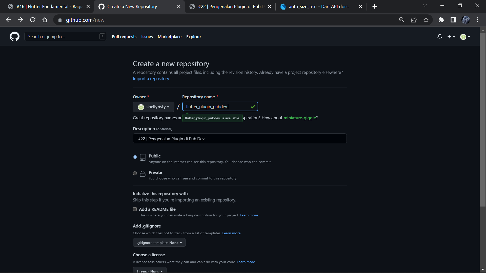
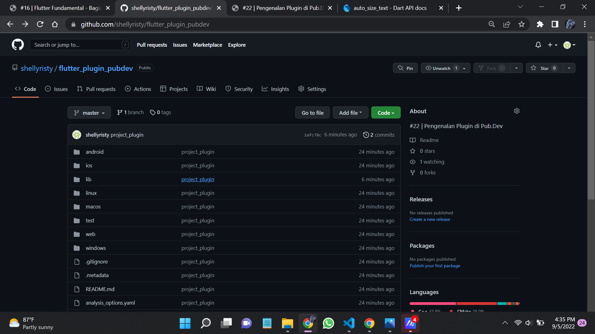
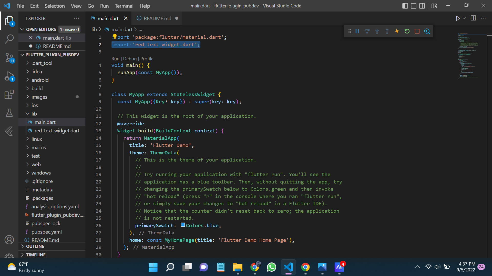

### Langkah 2 : Menambahkan Plugin
Tambahkan plugin auto_size_text menggunakan perintah berikut di terminal
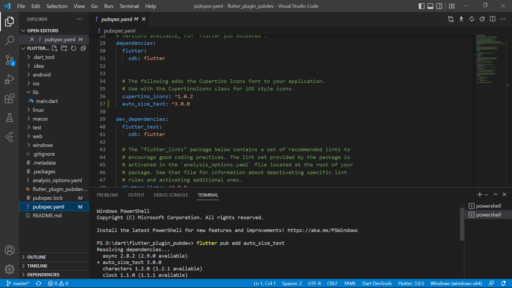
Jika berhasil, maka akan tampil nama plugin beserta versinya di file pubspec.yaml pada bagian dependencies.
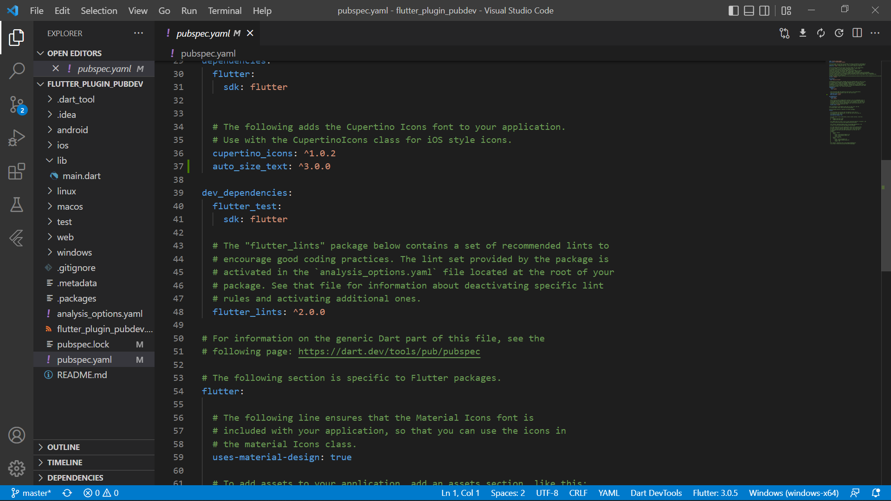

### Langkah 3 : Buat file red_text_widget.dart
Buat file baru bernama red_text_widget.dart di dalam folder lib lalu isi kode seperti berikut.
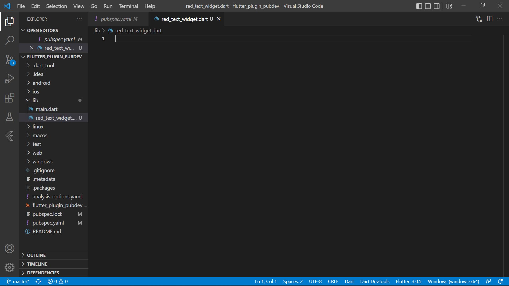
Membuat class RedTextWidget pada file red_text_widget.dart
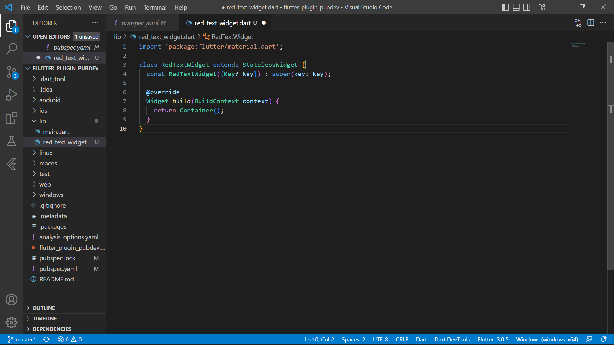

### Langkah 4 : Tambah Widget AutoSizeText
Masih di file red_text_widget.dart, untuk menggunakan plugin auto_size_text, ubahlah kode return Container() menjadi seperti berikut.
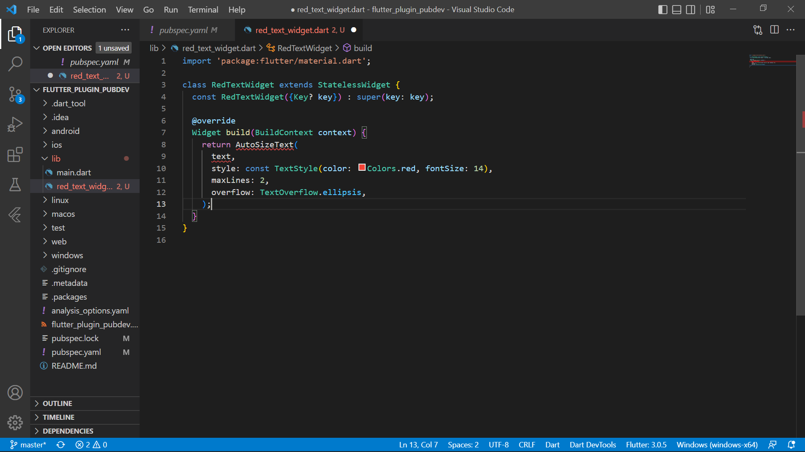

### Langkah 5 : Buat Variabel text dan parameter di constructor
Tambahkan variabel text dan parameter di constructor seperti berikut.
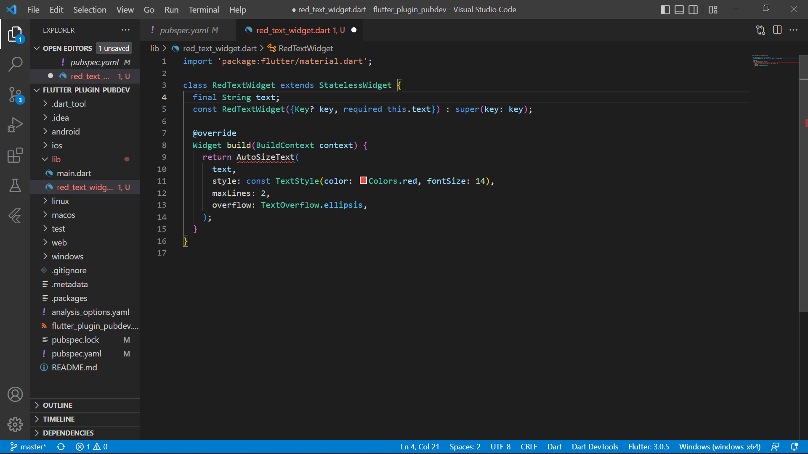
Penambahan import 'package:auto_size_text/auto_size_text.dart' 
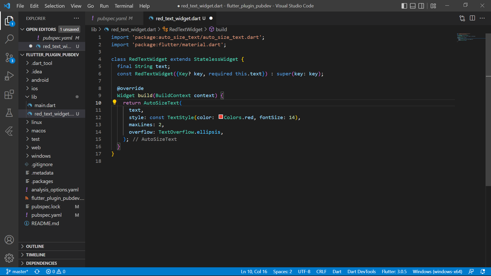

### Langkah 6 : Tambahkan widget di main.dart
Buka file main.dart lalu tambahkan di dalam children: pada class _MyHomePageState
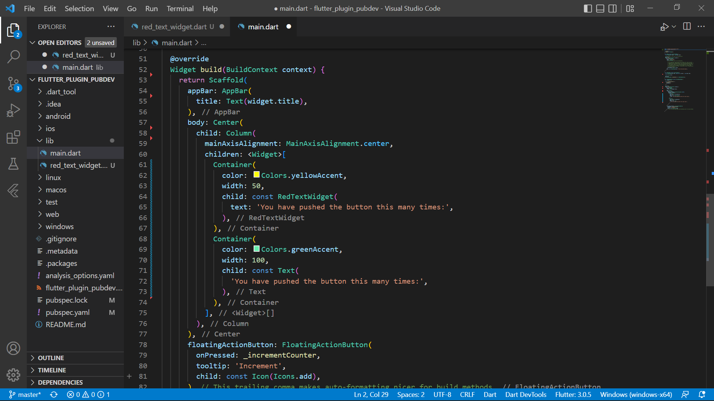
Run aplikasi tersebut dengan tekan F5, maka hasilnya akan seperti berikut.
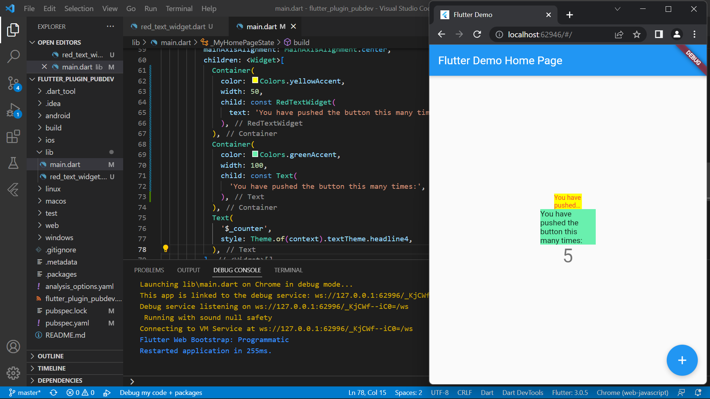

## Tugas Praktikum 2 Jelaskan maksud dari langkah 2 pada praktikum tersebut!
Maksud dari langkah dua yaitu menambahkan External Package pada Dependencies, dengan memasukkan perintah flutter pub add auto_size_text yang mana merupakan plugin dari package auto_size_text. selain cara tersebut juga bisa langsung mengetikkan perintah auto_size_text: ^3.0.0 pada baris kode dependencies di pubspec.yaml.
## Tugas Praktikum 3 Jelaskan maksud dari langkah 5 pada praktikum tersebut!
Variabel text digunakan untuk menampung data string yang nantinya akan di widget autosizetext dan constructor redtextwidget, ketika redtextwidget di isi nilainya, maka nilai input akan berubah sesuai fungsi redtextwidget yg dimana redtextwidget mengembalikan widget autosizetext
## Tugas Praktikum 4 Pada langkah 6 terdapat dua widget yang ditambahkan, jelaskan fungsi dan perbedaannya!
Widget tersebut merupakan widget container yang bertugas sebagai pembungkus dari widget lain. untuk widget yang pertama container berwarna kuning dengan text didalamnya "You have pushed the button this many times:". Dan widget kedua container berwarna hijau dengan text You have pushed the button this many times:
## Tugas Praktikum 5 Jelaskan maksud dari tiap parameter yang ada di dalam plugin auto_size_text berdasarkan tautan pada dokumentasi ini !
* Key : untuk mengontrol bagaimana suatu widget menggantikan widget lainnya di dalam widget tree.
* Style : Jika bukan null, style yang digunakan untuk teks ini
* overflow : menentukan bagaimana menangani teks inline yang meluap kontainer blok atau pembungkus yang menentukan ukuran teks tersebut
* maxLines : Jumlah maksimum baris opsional untuk teks yang akan dibentangkan.

